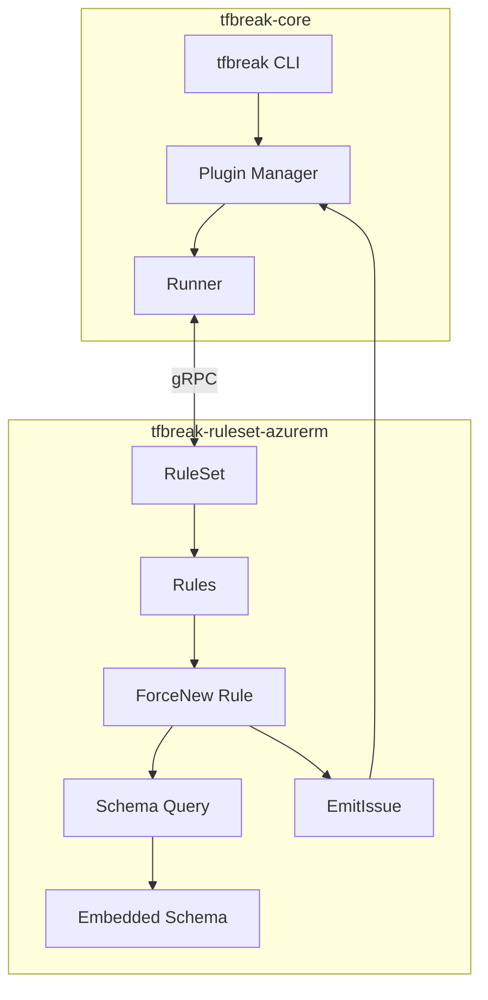
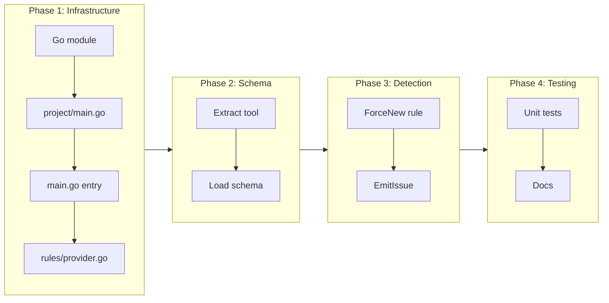

# Plugin Foundation with tflint-Aligned Interface

## Change Summary

Implement tfbreak-ruleset-azurerm using tfbreak's tflint-aligned plugin interface. The project structure, rule organization, and entry point align with tflint-ruleset-azurerm patterns, while the detection approach differs intentionally: we use schema-driven detection with a single generic ForceNew rule rather than per-resource rules.

## Motivation and Background

tfbreak-core provides provider-agnostic breaking change detection. Azure-specific concerns (ForceNew attributes) require a plugin. The plugin must:

1. **Implement RuleSet interface** - What tfbreak expects from plugins
2. **Use Runner interface** - To access old/new Terraform configurations
3. **Report via EmitIssue** - Standard way to report findings

### Alignment with tflint-ruleset-azurerm

We align with [tflint-ruleset-azurerm](https://github.com/terraform-linters/tflint-ruleset-azurerm) patterns where appropriate:

| Aspect | tflint-ruleset-azurerm | tfbreak-ruleset-azurerm | Aligned? |
|--------|------------------------|-------------------------|----------|
| Entry point | `main.go` with `plugin.Serve()` | `main.go` with `plugin.Serve()` | Yes |
| Version management | `project/main.go` with `Version` const | `project/main.go` with `Version` const | Yes |
| Rule organization | `rules/` directory | `rules/` directory | Yes |
| Rule listing | `rules/provider.go` with `Rules` var | `rules/provider.go` with `Rules` var | Yes |
| Severity levels | ERROR, WARNING, NOTICE | ERROR, WARNING, NOTICE | Yes |
| Rule structure | Individual rules per validation | Single schema-driven rule | No - intentional |
| Detection approach | Per-attribute validation rules | Schema-driven ForceNew detection | No - intentional |
| Code generation | Auto-generate from API specs | Extract schema at build time | Partial |

### Intentional Deviations

**Why we use schema-driven detection instead of per-resource rules:**

tflint-ruleset-azurerm has 150+ individual rules, many auto-generated from Azure REST API specs. Each rule validates a specific attribute pattern (e.g., `azurerm_storage_account_invalid_name`).

We intentionally deviate because:
1. **Different problem domain**: tflint validates static config correctness; we detect breaking changes between config versions
2. **ForceNew is metadata-driven**: The Azure provider schema already marks ForceNew attributes - we query it dynamically
3. **Automatic coverage**: One rule covers 900+ resources; no per-resource maintenance
4. **No code generation needed**: Schema embedding replaces code generation for each resource

## Change Drivers

* Must adhere to tfbreak's tflint-aligned plugin interface
* Must detect ForceNew attribute changes
* Should scale to 900+ azurerm resource types
* Should minimize maintenance burden
* Should align with tflint-ruleset-azurerm project structure where appropriate

## Current State

Empty repository with LICENSE, README, CI/CD workflows.

## Proposed Change

Implement plugin with tflint-ruleset-azurerm-aligned structure:

1. Entry point with `plugin.Serve()`
2. Version management in `project/` package
3. Rules organized in `rules/` directory
4. Schema extraction and embedding
5. Schema-driven ForceNew detection

### Project Structure (tflint-ruleset-azurerm aligned)

```
tfbreak-ruleset-azurerm/
├── main.go                           # Entry point (like tflint-ruleset-azurerm)
├── project/
│   └── main.go                       # Version constant and helpers
├── rules/
│   ├── provider.go                   # Rules slice (like tflint-ruleset-azurerm)
│   └── azurerm_force_new.go          # ForceNew detection rule
├── schema/
│   ├── schema.go                     # Schema loader
│   └── azurerm.json.gz               # Embedded provider schema
├── tools/
│   └── extract-schema/
│       └── main.go                   # Schema extraction tool
├── docs/
│   ├── adr/
│   └── cr/
└── .github/
    └── workflows/
        ├── ci.yml
        ├── release.yml
        └── update-schema.yml
```

### Comparison with tflint-ruleset-azurerm Structure

```
tflint-ruleset-azurerm/              tfbreak-ruleset-azurerm/
├── main.go                    ──►   ├── main.go
├── project/                   ──►   ├── project/
│   └── main.go                      │   └── main.go
├── rules/                     ──►   ├── rules/
│   ├── provider.go                  │   ├── provider.go
│   ├── azurerm_*.go (many)          │   └── azurerm_force_new.go (one)
│   └── apispec/ (generated)         │
├── tools/                     ──►   ├── schema/
│   └── apispec-rule-gen/            │   ├── schema.go
│                                    │   └── azurerm.json.gz
│                              ──►   └── tools/
│                                        └── extract-schema/
```

### Proposed Architecture



## Requirements

### Functional Requirements

1. The plugin **MUST** implement RuleSetName() returning "azurerm"
2. The plugin **MUST** implement RuleSetVersion() returning semver from `project.Version`
3. The plugin **MUST** implement RuleNames() returning rule list
4. The plugin **MUST** implement VersionConstraint() for tfbreak compatibility
5. The plugin **MUST** implement Check(ruleName, runner) for rule execution
6. The plugin **MUST** use runner.GetOldResourceContent() to access old config
7. The plugin **MUST** use runner.GetNewResourceContent() to access new config
8. The plugin **MUST** use runner.EmitIssue() to report findings
9. The plugin **MUST** embed Azure RM provider schema
10. The plugin **MUST** detect ForceNew attribute changes
11. The plugin **MUST** report findings with appropriate severity (ERROR, WARNING, NOTICE)
12. The plugin **MUST** include remediation guidance

### Non-Functional Requirements

1. The plugin **MUST** start within 1 second
2. The plugin **MUST** complete Check within 30 seconds for typical modules
3. The plugin **MUST** not require network access
4. The plugin **MUST** not require Azure credentials
5. The plugin **MUST** be cross-compiled for major platforms

## Affected Components

* New: `main.go` - Entry point (tflint-aligned)
* New: `project/main.go` - Version and helpers (tflint-aligned)
* New: `rules/provider.go` - Rules listing (tflint-aligned)
* New: `rules/azurerm_force_new.go` - ForceNew detection rule
* New: `schema/schema.go` - Schema loader
* New: `schema/azurerm.json.gz` - Embedded schema
* New: `tools/extract-schema/main.go` - Schema extraction

## Scope Boundaries

### In Scope

* RuleSet interface implementation
* tflint-aligned project structure
* Schema extraction and embedding
* Single azurerm_force_new rule
* Basic tests
* CI/CD workflows

### Out of Scope

* Deprecated attribute detection - future CR
* Cross-resource analysis - future CR
* Custom configurations - future CR
* Per-resource rules (intentional deviation from tflint-ruleset-azurerm)

## Implementation Approach

### Phase 1: Plugin Infrastructure (tflint-aligned)

1. Initialize Go module
2. Create `project/main.go` with Version constant
3. Implement entry point in `main.go` with `plugin.Serve()`
4. Create `rules/provider.go` with Rules slice

### Phase 2: Schema Infrastructure

1. Create schema extraction tool in `tools/extract-schema/`
2. Extract and compress azurerm schema
3. Implement schema loader in `schema/`

### Phase 3: ForceNew Detection

1. Implement `rules/azurerm_force_new.go`
2. Query schema for ForceNew attributes
3. Compare old/new configs
4. Report via EmitIssue with appropriate severity

### Phase 4: Testing

1. Unit tests with mock Runner
2. Integration tests
3. Documentation

### Implementation Flow



## Test Strategy

### Tests to Add

| Test File | Test Name | Description | Inputs | Expected Output |
|-----------|-----------|-------------|--------|-----------------|
| `rules/provider_test.go` | `TestRules_Contains` | Verify rules list | N/A | Contains ForceNew rule |
| `rules/azurerm_force_new_test.go` | `TestForceNew_Name` | Verify rule name | N/A | "azurerm_force_new" |
| `rules/azurerm_force_new_test.go` | `TestForceNew_Severity` | Verify severity | N/A | ERROR |
| `rules/azurerm_force_new_test.go` | `TestForceNew_DetectsChange` | Detect ForceNew | Changed location | Issue emitted |
| `rules/azurerm_force_new_test.go` | `TestForceNew_NoChange` | No false positive | Same config | No issue |
| `rules/azurerm_force_new_test.go` | `TestForceNew_NonForceNew` | Ignore non-ForceNew | Changed tags | No issue |
| `schema/schema_test.go` | `TestSchema_Load` | Load schema | Embedded data | Schema loaded |
| `schema/schema_test.go` | `TestSchema_GetForceNew` | Query ForceNew | resource_group | ["name", "location"] |

### Tests to Modify

N/A - new implementation

### Tests to Remove

N/A - new implementation

## Acceptance Criteria

### AC-1: Plugin implements RuleSet interface (tflint-aligned)

```gherkin
Given tfbreak-ruleset-azurerm binary
When tfbreak loads the plugin
Then RuleSetName() returns "azurerm"
  And RuleSetVersion() returns project.Version
  And RuleNames() includes "azurerm_force_new"
```

### AC-2: Project structure matches tflint-ruleset-azurerm patterns

```gherkin
Given the plugin repository
Then main.go exists at root with plugin.Serve()
  And project/main.go exists with Version constant
  And rules/provider.go exists with Rules slice
  And rules/azurerm_force_new.go exists
```

### AC-3: Plugin uses Runner to access configs

```gherkin
Given the plugin's Check method is called
When it needs old config
Then it calls runner.GetOldResourceContent()
When it needs new config
Then it calls runner.GetNewResourceContent()
```

### AC-4: Plugin reports via EmitIssue with correct severity

```gherkin
Given a ForceNew attribute changed
When the plugin detects it
Then it calls runner.EmitIssue() with:
  | Field       | Value                    |
  | RuleName    | azurerm_force_new        |
  | Severity    | ERROR                    |
  | Message     | Describes the change     |
  | Remediation | Provides fix guidance    |
```

### AC-5: Schema-driven detection works

```gherkin
Given embedded azurerm provider schema
When checking azurerm_resource_group with changed location
Then ForceNew is detected
When checking azurerm_storage_account with changed account_kind
Then ForceNew is detected
```

### AC-6: No false positives

```gherkin
Given azurerm_resource_group with changed tags
When the plugin checks
Then no issue is emitted
  Because tags is not a ForceNew attribute
```

## Quality Standards Compliance

### Build & Compilation

- [ ] Code compiles without errors
- [ ] No compiler warnings

### Linting & Code Style

- [ ] go vet passes
- [ ] Code follows conventions

### Test Execution

- [ ] All tests pass
- [ ] Adequate coverage

### Documentation

- [ ] README updated
- [ ] Code documented

### Verification Commands

```bash
# Build
go build ./...

# Lint
go vet ./...

# Test
go test -race -v ./...
```

## Risks and Mitigation

### Risk 1: tfbreak-core plugin interface not stable

**Likelihood:** high
**Impact:** high
**Mitigation:** Develop in parallel with tfbreak-core. Version interface from day one.

### Risk 2: Schema extraction complexity

**Likelihood:** medium
**Impact:** medium
**Mitigation:** Start simple with terraform providers schema -json output.

### Risk 3: Schema size

**Likelihood:** medium
**Impact:** low
**Mitigation:** gzip compression. Filter to ForceNew metadata only.

## Dependencies

* tfbreak-core plugin interface (CR-0013)
* Azure RM provider schema

## Estimated Effort

* Phase 1 (Infrastructure): 2 hours
* Phase 2 (Schema): 3 hours
* Phase 3 (Detection): 3 hours
* Phase 4 (Testing): 2 hours
* **Total: ~10 hours**

## Decision Outcome

Chosen approach: "Schema-driven detection with tflint-aligned structure", because it adheres to the standard interface and project organization while providing maintainable detection for 900+ resources through a single rule.

## Related Items

* ADR-0001: Plugin Inception (this repo)
* tfbreak-core ADR-0002: Plugin Architecture
* tfbreak-core CR-0013: Plugin Infrastructure

## More Information

### Complete Entry Point (tflint-aligned)

```go
// main.go
package main

import (
    "github.com/jokarl/tfbreak-core/plugin"
    "github.com/jokarl/tfbreak-ruleset-azurerm/project"
    "github.com/jokarl/tfbreak-ruleset-azurerm/rules"
)

func main() {
    plugin.Serve(&plugin.ServeOpts{
        RuleSet: &plugin.BuiltinRuleSet{
            Name:    "azurerm",
            Version: project.Version,
            Rules:   rules.Rules,
        },
    })
}
```

### Version Management (tflint-aligned)

```go
// project/main.go
package project

import "fmt"

// Version is ruleset version
const Version string = "0.1.0"

// ReferenceLink returns the rule reference link
func ReferenceLink(name string) string {
    return fmt.Sprintf("https://github.com/jokarl/tfbreak-ruleset-azurerm/blob/v%s/docs/rules/%s.md", Version, name)
}
```

### Rules Provider (tflint-aligned)

```go
// rules/provider.go
package rules

import "github.com/jokarl/tfbreak-core/plugin"

// Rules is a list of all rules
var Rules = []plugin.Rule{
    NewAzurermForceNewRule(),
}
```

### ForceNew Rule Implementation

```go
// rules/azurerm_force_new.go
package rules

import (
    "fmt"
    "strings"

    "github.com/jokarl/tfbreak-core/plugin"
    "github.com/jokarl/tfbreak-ruleset-azurerm/project"
    "github.com/jokarl/tfbreak-ruleset-azurerm/schema"
)

// AzurermForceNewRule checks for ForceNew attribute changes
type AzurermForceNewRule struct {
    plugin.DefaultRule
    schema *schema.Schema
}

// NewAzurermForceNewRule returns a new ForceNew rule
func NewAzurermForceNewRule() *AzurermForceNewRule {
    return &AzurermForceNewRule{
        schema: schema.Load(),
    }
}

// Name returns the rule name
func (r *AzurermForceNewRule) Name() string {
    return "azurerm_force_new"
}

// Enabled returns whether the rule is enabled by default
func (r *AzurermForceNewRule) Enabled() bool {
    return true
}

// Severity returns the rule severity
func (r *AzurermForceNewRule) Severity() plugin.Severity {
    return plugin.ERROR
}

// Link returns the rule reference link
func (r *AzurermForceNewRule) Link() string {
    return project.ReferenceLink(r.Name())
}

// Check checks for ForceNew attribute changes
func (r *AzurermForceNewRule) Check(runner plugin.Runner) error {
    // Get resources from old and new configs
    oldContent, err := runner.GetOldModuleContent(resourceSchema)
    if err != nil {
        return err
    }
    newContent, err := runner.GetNewModuleContent(resourceSchema)
    if err != nil {
        return err
    }

    // Compare and detect ForceNew changes
    for resourceType, newResources := range newContent.Resources {
        if !strings.HasPrefix(resourceType, "azurerm_") {
            continue
        }

        forceNewAttrs := r.schema.GetForceNewAttributes(resourceType)

        for name, newRes := range newResources {
            oldRes := oldContent.Resources[resourceType][name]
            if oldRes == nil {
                continue
            }

            for _, attr := range forceNewAttrs {
                if r.attributeChanged(oldRes, newRes, attr) {
                    runner.EmitIssue(r,
                        fmt.Sprintf("Changing %q forces recreation of %s.%s", attr, resourceType, name),
                        newRes.Range,
                    )
                }
            }
        }
    }

    return nil
}
```

### Severity Levels (tflint-aligned)

| Severity | tflint Constant | tfbreak Constant | Usage |
|----------|-----------------|------------------|-------|
| Error | `tflint.ERROR` | `plugin.ERROR` | ForceNew attribute changed |
| Warning | `tflint.WARNING` | `plugin.WARNING` | Deprecated attribute |
| Notice | `tflint.NOTICE` | `plugin.NOTICE` | Informational |
