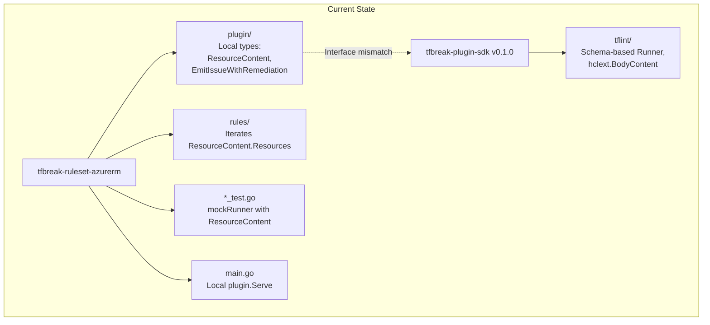
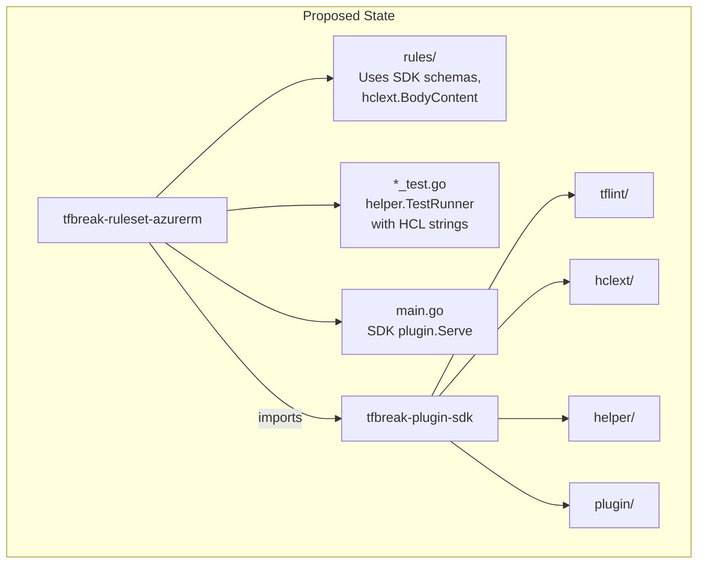

# Migrate to tfbreak-plugin-sdk

## Change Summary

Migrate tfbreak-ruleset-azurerm from local type definitions to the tfbreak-plugin-sdk. This involves updating imports, removing the local `plugin/` package, **rewriting rule implementations** to use schema-based content access, and converting tests to use `helper.TestRunner`. This CR validates the SDK by proving it works with a real plugin.

**IMPORTANT**: This migration requires significant changes to rule implementations, not just import updates. The SDK uses a schema-based approach that differs from the current pre-parsed `ResourceContent` approach.

## Motivation and Background

tfbreak-ruleset-azurerm currently defines its own types in `plugin/types.go` and uses manual mock runners in tests. After tfbreak-plugin-sdk v0.1.0 completion, this CR:

1. Validates the SDK works for real plugin development
2. Removes code duplication
3. Provides a reference implementation for other plugins
4. Enables proper integration with tfbreak-core in the future

This is the "proof of the pudding" CR that validates all previous SDK work.

## Change Drivers

* Validate SDK usability with real plugin
* Remove duplicate type definitions
* Simplify test setup with helper.TestRunner
* Enable tfbreak-core integration

## Current State

tfbreak-ruleset-azurerm has:
- `plugin/types.go` - Local Severity, Rule, Runner, RuleSet, ResourceContent, etc.
- `plugin/types_test.go` - Tests for local types
- `rules/azurerm_force_new.go` - Rule using local plugin types with `ResourceContent`
- `rules/azurerm_force_new_test.go` - Tests with manual `mockRunner`
- `rules/provider.go` - Rule registry using `plugin.Rule`
- `main.go` - Uses local `plugin.Serve`

### Current Runner Interface (Local)

```go
// Current local Runner interface
type Runner interface {
    GetOldModuleContent() (*ResourceContent, error)  // Returns pre-parsed content
    GetNewModuleContent() (*ResourceContent, error)
    EmitIssue(rule Rule, message string, location hcl.Range)
    EmitIssueWithRemediation(rule Rule, message string, location hcl.Range, remediation string)
}

// ResourceContent - pre-parsed, structured data
type ResourceContent struct {
    Resources map[string]map[string]*ResourceBody  // type -> name -> body
}
```

### SDK Runner Interface (Target)

```go
// SDK Runner interface - schema-based
type Runner interface {
    GetOldModuleContent(schema *hclext.BodySchema, opts *GetModuleContentOption) (*hclext.BodyContent, error)
    GetNewModuleContent(schema *hclext.BodySchema, opts *GetModuleContentOption) (*hclext.BodyContent, error)
    GetOldResourceContent(resourceType string, schema *hclext.BodySchema, opts *GetModuleContentOption) (*hclext.BodyContent, error)
    GetNewResourceContent(resourceType string, schema *hclext.BodySchema, opts *GetModuleContentOption) (*hclext.BodyContent, error)
    EmitIssue(rule Rule, message string, issueRange hcl.Range) error
    DecodeRuleConfig(ruleName string, target any) error
}

// hclext.BodyContent - raw HCL structure
type BodyContent struct {
    Attributes map[string]*Attribute
    Blocks     []*Block
}
```

### Current State Diagram



## Proposed Change

Update tfbreak-ruleset-azurerm to use the SDK. This requires:

1. **Update `go.mod`** to depend on tfbreak-plugin-sdk
2. **Delete `plugin/types.go`** and `plugin/types_test.go`
3. **Rewrite rule implementations** to use schema-based content access:
   - Use `GetOldResourceContent(type, schema, nil)` instead of `GetOldModuleContent()`
   - Process `hclext.BodyContent.Blocks` instead of `ResourceContent.Resources`
   - Define HCL schemas for attribute extraction
4. **Update `EmitIssue` calls** - remediation must be included in message (SDK has no `EmitIssueWithRemediation`)
5. **Convert tests** to use `helper.TestRunner` with actual HCL content
6. **Update `main.go`** to use SDK's `plugin.Serve`

### Proposed State Diagram



## Requirements

### Functional Requirements

#### SDK Dependency
1. tfbreak-ruleset-azurerm **MUST** depend on `github.com/jokarl/tfbreak-plugin-sdk`
2. tfbreak-ruleset-azurerm **MUST** delete `plugin/types.go` and `plugin/types_test.go`

#### Rule Implementation Changes
3. Rules **MUST** use `tflint.Runner` interface from SDK
4. Rules **MUST** use `GetOldResourceContent/GetNewResourceContent` with schemas
5. Rules **MUST** define `hclext.BodySchema` for each resource type they check
6. Rules **MUST** process `hclext.BodyContent.Blocks` to extract resource data
7. Rules **MUST** use `EmitIssue` (without separate remediation parameter)
8. Remediation guidance **SHOULD** be included in the issue message

#### Test Changes
9. Tests **MUST** use `github.com/jokarl/tfbreak-plugin-sdk/helper` for TestRunner
10. Tests **MUST** provide actual HCL content strings (not pre-parsed ResourceContent)
11. Tests **MUST** use `helper.AssertIssues` for issue verification

#### Main Entry Point
12. `main.go` **MUST** use `github.com/jokarl/tfbreak-plugin-sdk/plugin` for Serve

#### Compatibility
13. All existing tests **MUST** continue to pass (with updated implementations)
14. The plugin **MUST** compile with `go build`

### Non-Functional Requirements

1. No functional changes to rule behavior (same issues detected)
2. Test coverage **MUST** remain at or above current levels
3. Migration **MUST** be completed in a single PR for atomicity

## Affected Components

**Deleted files:**
* `plugin/types.go`
* `plugin/types_test.go`

**Modified files (major rewrites):**
* `rules/azurerm_force_new.go` - Complete rewrite of Check() method
* `rules/azurerm_force_new_test.go` - Convert to helper.TestRunner with HCL strings
* `rules/provider.go` - Update imports

**Modified files (import updates):**
* `go.mod` - Add SDK dependency
* `main.go` - Update imports and types

## Scope Boundaries

### In Scope

* Dependency update to SDK
* Delete local plugin package
* Rewrite rule Check() implementations for schema-based access
* Convert tests to helper.TestRunner with HCL content
* Include remediation in issue messages
* Verify all tests pass

### Out of Scope ("Here, But Not Further")

* New rules - No new functionality
* Schema changes - Existing schema package unchanged
* tfbreak-core integration - Separate future work
* Performance optimization - Not in scope
* Adding `EmitIssueWithRemediation` to SDK - Future consideration

## Impact Assessment

### User Impact

None for end users. This is an internal refactoring.

### Technical Impact

* Removes ~170 lines of local type definitions
* Rule Check() methods require complete rewrite (~60% code change)
* Tests require conversion to HCL strings (more realistic testing)
* Creates dependency on external SDK
* Validates SDK design with real-world usage

### Business Impact

* Validates SDK investment
* Reduces maintenance burden
* Provides reference implementation for future plugins

## Implementation Approach

### Phase 1: Update go.mod

```go
require (
    github.com/jokarl/tfbreak-plugin-sdk v0.1.0
    // ... existing dependencies
)

// For local development:
replace github.com/jokarl/tfbreak-plugin-sdk => ../tfbreak-plugin-sdk
```

### Phase 2: Delete local plugin package

```bash
rm plugin/types.go plugin/types_test.go
# Keep plugin/ directory only if other files exist
```

### Phase 3: Update rules/provider.go

```go
package rules

import "github.com/jokarl/tfbreak-plugin-sdk/tflint"

// Rules is the list of rules provided by this plugin.
var Rules = []tflint.Rule{
    NewAzurermForceNewRule(),
}
```

### Phase 4: Rewrite rules/azurerm_force_new.go

**Key changes:**
- Use `tflint.DefaultRule` embedding
- Define `hclext.BodySchema` for resource attributes
- Use `GetOldResourceContent/GetNewResourceContent` with schemas
- Process `hclext.Block` instead of `ResourceBody`
- Include remediation in message (no separate param)

```go
package rules

import (
    "fmt"
    "strings"

    "github.com/hashicorp/hcl/v2"
    "github.com/jokarl/tfbreak-plugin-sdk/hclext"
    "github.com/jokarl/tfbreak-plugin-sdk/tflint"
    "github.com/jokarl/tfbreak-ruleset-azurerm/project"
    "github.com/jokarl/tfbreak-ruleset-azurerm/schema"
)

type AzurermForceNewRule struct {
    tflint.DefaultRule
    schema *schema.Schema
}

func NewAzurermForceNewRule() *AzurermForceNewRule {
    return &AzurermForceNewRule{
        schema: schema.Load(),
    }
}

func (r *AzurermForceNewRule) Name() string {
    return "azurerm_force_new"
}

func (r *AzurermForceNewRule) Link() string {
    return project.ReferenceLink(r.Name())
}

func (r *AzurermForceNewRule) Check(runner tflint.Runner) error {
    // Get list of azurerm resource types from schema
    resourceTypes := r.schema.GetResourceTypes()

    for _, resourceType := range resourceTypes {
        if !strings.HasPrefix(resourceType, "azurerm_") {
            continue
        }

        forceNewAttrs := r.schema.GetForceNewAttributes(resourceType)
        if len(forceNewAttrs) == 0 {
            continue
        }

        // Build schema for the ForceNew attributes
        attrSchemas := make([]hclext.AttributeSchema, len(forceNewAttrs))
        for i, attr := range forceNewAttrs {
            attrSchemas[i] = hclext.AttributeSchema{Name: attr}
        }
        bodySchema := &hclext.BodySchema{Attributes: attrSchemas}

        // Get old and new content for this resource type
        oldContent, err := runner.GetOldResourceContent(resourceType, bodySchema, nil)
        if err != nil {
            return fmt.Errorf("get old %s: %w", resourceType, err)
        }
        newContent, err := runner.GetNewResourceContent(resourceType, bodySchema, nil)
        if err != nil {
            return fmt.Errorf("get new %s: %w", resourceType, err)
        }

        // Build map of old resources by name
        oldByName := make(map[string]*hclext.Block)
        for _, block := range oldContent.Blocks {
            if len(block.Labels) >= 2 {
                oldByName[block.Labels[1]] = block
            }
        }

        // Compare each new resource to its old version
        for _, newBlock := range newContent.Blocks {
            if len(newBlock.Labels) < 2 {
                continue
            }
            name := newBlock.Labels[1]
            oldBlock, exists := oldByName[name]
            if !exists {
                continue // New resource, not a ForceNew change
            }

            // Check each ForceNew attribute
            for _, attr := range forceNewAttrs {
                oldAttr := oldBlock.Body.Attributes[attr]
                newAttr := newBlock.Body.Attributes[attr]

                if r.attributeChanged(oldAttr, newAttr) {
                    // Include remediation in message
                    message := fmt.Sprintf(
                        "Changing %q forces recreation of %s.%s. "+
                            "Consider using a moved block or creating a new resource with a different name.",
                        attr, resourceType, name,
                    )
                    issueRange := hcl.Range{}
                    if newAttr != nil {
                        issueRange = newAttr.Range
                    } else if newBlock.DefRange != (hcl.Range{}) {
                        issueRange = newBlock.DefRange
                    }
                    if err := runner.EmitIssue(r, message, issueRange); err != nil {
                        return err
                    }
                }
            }
        }
    }

    return nil
}

func (r *AzurermForceNewRule) attributeChanged(oldAttr, newAttr *hclext.Attribute) bool {
    if oldAttr == nil && newAttr == nil {
        return false
    }
    if oldAttr == nil || newAttr == nil {
        return true
    }
    // Compare raw expression bytes (simplified comparison)
    // Full implementation would evaluate expressions
    return string(oldAttr.Expr.Range().SliceBytes(nil)) != string(newAttr.Expr.Range().SliceBytes(nil))
}
```

**Note:** The attribute comparison is simplified. A full implementation would need to evaluate HCL expressions. This may require additional SDK methods or a separate comparison utility.

### Phase 5: Update main.go

```go
package main

import (
    "github.com/jokarl/tfbreak-plugin-sdk/plugin"
    "github.com/jokarl/tfbreak-plugin-sdk/tflint"
    "github.com/jokarl/tfbreak-ruleset-azurerm/project"
    "github.com/jokarl/tfbreak-ruleset-azurerm/rules"
)

func main() {
    plugin.Serve(&plugin.ServeOpts{
        RuleSet: &tflint.BuiltinRuleSet{
            Name:    "azurerm",
            Version: project.Version,
            Rules:   rules.Rules,
        },
    })
}
```

### Phase 6: Convert tests to helper.TestRunner

**Before (manual mock with ResourceContent):**
```go
func TestForceNew_DetectsChange(t *testing.T) {
    rule := NewAzurermForceNewRule()
    runner := &mockRunner{
        oldContent: &plugin.ResourceContent{
            Resources: map[string]map[string]*plugin.ResourceBody{
                "azurerm_resource_group": {
                    "example": {
                        Attributes: map[string]interface{}{
                            "location": "westeurope",
                        },
                    },
                },
            },
        },
        newContent: &plugin.ResourceContent{...},
    }
    // ...
}
```

**After (SDK helper with HCL strings):**
```go
func TestForceNew_DetectsChange(t *testing.T) {
    runner := helper.TestRunner(t,
        map[string]string{
            "main.tf": `
resource "azurerm_resource_group" "example" {
    name     = "my-rg"
    location = "westeurope"
}`,
        },
        map[string]string{
            "main.tf": `
resource "azurerm_resource_group" "example" {
    name     = "my-rg"
    location = "eastus"
}`,
        },
    )

    rule := NewAzurermForceNewRule()
    err := rule.Check(runner)
    if err != nil {
        t.Fatal(err)
    }

    helper.AssertIssues(t, helper.Issues{
        {Rule: rule, Message: `Changing "location" forces recreation of azurerm_resource_group.example`},
    }, runner.Issues)
}
```

## Test Strategy

### Tests to Add

None - existing tests are converted.

### Tests to Modify

| Test File | Test Name | Change Required |
|-----------|-----------|-----------------|
| `rules/azurerm_force_new_test.go` | `TestForceNew_DetectsChange` | Use helper.TestRunner with HCL strings |
| `rules/azurerm_force_new_test.go` | `TestForceNew_NoChange` | Use helper.TestRunner with HCL strings |
| `rules/azurerm_force_new_test.go` | `TestForceNew_NonForceNew` | Use helper.TestRunner with HCL strings |
| `rules/azurerm_force_new_test.go` | `TestForceNew_NewResource` | Use helper.TestRunner with HCL strings |
| `rules/azurerm_force_new_test.go` | `TestForceNew_NonAzurermResource` | Use helper.TestRunner with HCL strings |
| `rules/provider_test.go` | All tests | Update imports |

### Tests to Remove

| Test File | Test Name | Reason |
|-----------|-----------|--------|
| `plugin/types_test.go` | All tests | Package deleted; covered by SDK tests |
| `rules/azurerm_force_new_test.go` | `mockRunner` struct | Replaced by helper.TestRunner |

## Acceptance Criteria

### AC-1: SDK dependency added

```gherkin
Given tfbreak-ruleset-azurerm go.mod
When inspected
Then it requires github.com/jokarl/tfbreak-plugin-sdk
```

### AC-2: Local plugin package deleted

```gherkin
Given tfbreak-ruleset-azurerm repository
When listing files
Then plugin/types.go does not exist
  And plugin/types_test.go does not exist
```

### AC-3: Rules use SDK schema-based access

```gherkin
Given rules/azurerm_force_new.go
When inspecting imports and implementation
Then it imports github.com/jokarl/tfbreak-plugin-sdk/tflint
  And it imports github.com/jokarl/tfbreak-plugin-sdk/hclext
  And Check() uses GetOldResourceContent with schema parameter
  And Check() uses GetNewResourceContent with schema parameter
  And it does not import local plugin package
```

### AC-4: Tests use helper.TestRunner with HCL

```gherkin
Given rules/azurerm_force_new_test.go
When inspecting the code
Then it uses helper.TestRunner(t, oldFiles, newFiles) with HCL strings
  And it uses helper.AssertIssues
  And no mockRunner struct is defined
  And no ResourceContent is constructed manually
```

### AC-5: All tests pass

```gherkin
Given the migrated tfbreak-ruleset-azurerm
When go test -race ./... is executed
Then all tests pass
```

### AC-6: Plugin compiles

```gherkin
Given the migrated tfbreak-ruleset-azurerm
When go build is executed
Then a binary is produced without errors
```

## Quality Standards Compliance

### Verification Commands

```bash
# Verify dependency
grep "tfbreak-plugin-sdk" go.mod

# Verify local plugin deleted
test ! -f plugin/types.go

# Verify SDK imports in rules
grep -r "tfbreak-plugin-sdk/tflint" rules/
grep -r "tfbreak-plugin-sdk/hclext" rules/

# Build verification
go build ./...

# Lint verification
go vet ./...

# Test execution
go test -race -v ./...

# Test coverage
go test -coverprofile=coverage.out ./...
go tool cover -func=coverage.out
```

## Risks and Mitigation

### Risk 1: Schema-based approach more complex than expected

**Likelihood:** High
**Impact:** Medium
**Mitigation:** Start with simplified attribute comparison; iterate on full expression evaluation

### Risk 2: helper.TestRunner insufficient for complex scenarios

**Likelihood:** Medium
**Impact:** Medium
**Mitigation:** Extend helper package as needed; document any required SDK changes

### Risk 3: Attribute comparison without expression evaluation

**Likelihood:** High
**Impact:** Medium
**Mitigation:** For v0.1.0, use simplified byte comparison; plan expression evaluation for future

### Risk 4: Loss of remediation in EmitIssue

**Likelihood:** Low (remediation included in message)
**Impact:** Low
**Mitigation:** Include remediation text in issue message; consider SDK enhancement for v0.2.0

## Dependencies

* tfbreak-plugin-sdk v0.1.0 (COMPLETE)
* Local development: replace directive in go.mod

## Estimated Effort

| Task | Effort |
|------|--------|
| Update go.mod | 5 minutes |
| Delete local plugin | 5 minutes |
| Update main.go | 10 minutes |
| Update rules/provider.go | 5 minutes |
| **Rewrite azurerm_force_new.go Check()** | **2 hours** |
| **Convert all tests to HCL strings** | **2 hours** |
| Debug and fix issues | 1 hour |
| Verify and validate | 30 minutes |
| **Total** | **~6 hours** |

## Decision Outcome

Chosen approach: "Full migration to SDK with rule rewrites", because:
1. SDK is complete and ready for use
2. Schema-based approach is more aligned with tflint patterns
3. Testing with actual HCL is more realistic
4. Validates SDK design with real-world usage

## Related Items

* Architecture decisions: tfbreak-plugin-sdk/docs/adr/ADR-0001-tflint-aligned-plugin-sdk.md
* SDK CRs: tfbreak-plugin-sdk CR-0002 through CR-0007 (COMPLETE)
* tfbreak-core: CR-0013 plugin infrastructure (IMPLEMENTED)
* Previous CR: CR-0001-plugin-foundation.md

## More Information

### Key Interface Differences Summary

| Aspect | Local (Current) | SDK (Target) |
|--------|-----------------|--------------|
| Content access | `GetOldModuleContent()` | `GetOldResourceContent(type, schema, nil)` |
| Return type | `*ResourceContent` (pre-parsed) | `*hclext.BodyContent` (schema-based) |
| Resource iteration | `content.Resources[type][name]` | `for _, block := range content.Blocks` |
| Attribute access | `body.Attributes["name"]` (interface{}) | `body.Attributes["name"]` (*hclext.Attribute) |
| Emit issue | `EmitIssue(rule, msg, range)` | `EmitIssue(rule, msg, range) error` |
| Remediation | `EmitIssueWithRemediation(...)` | Include in message |

### Migration Checklist

- [x] Add SDK to go.mod (with replace directive for dev)
- [x] Delete plugin/types.go
- [x] Delete plugin/types_test.go
- [x] Update main.go imports and types
- [x] Update rules/provider.go imports
- [x] Rewrite AzurermForceNewRule.Check() for schema-based access
- [x] Convert TestForceNew_DetectsChange to HCL
- [x] Convert TestForceNew_NoChange to HCL
- [x] Convert TestForceNew_NonForceNew to HCL
- [x] Convert TestForceNew_NewResource to HCL
- [x] Convert TestForceNew_NonAzurermResource to HCL
- [x] Remove mockRunner struct
- [x] Run go build
- [x] Run go test -race ./...
- [x] Verify coverage maintained
